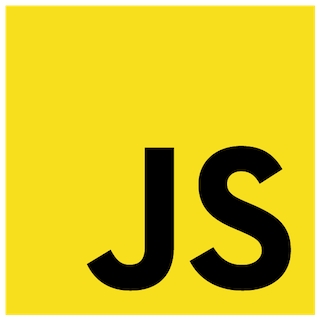

# IST-Smart-Door-Lock
___

This GitHub repository contains both the Python (.py) and the JavaScript (.js) code for my Task 2 IST assessment.
 
Use the images below to go to the respective files.

--

|  **Click THIS Python logo for the speech recognition code** |  **Click THIS JS logo for the smartphone-controlled doorlock code** |  **Click THIS Python logo for the switch pullup/pulldown code** |
|----------------------------------------------------------------------------------------------------------------------------------------------------------------------------------------------|-----------------------------------------------------------------------------------------------------------------------------------------------------------------------------------------------|-----------------------------------------------------------------------------------------------------------------------------------------------------------------------------------------------|

